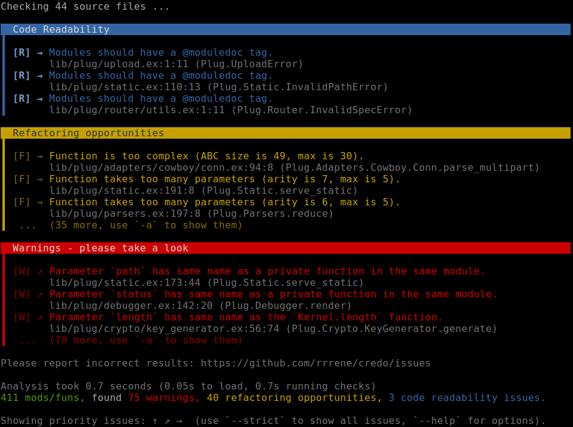
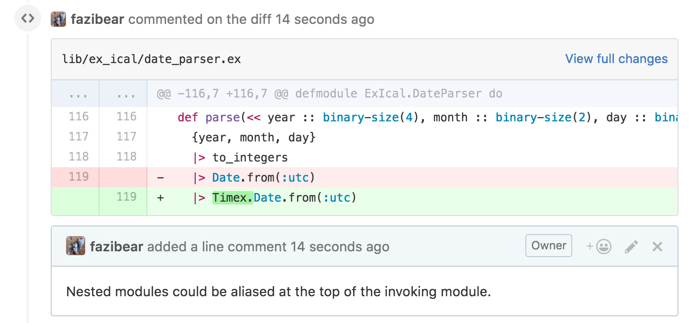

While I was working on the Elixir, I realized that it would be nice to have some static code analysis tool integrate with you build process. In Elixir world we have a [credo](https://github.com/rrrene/credo). It’s a very nice tool we can add to our mix.exs file and analyze our project simply typing:

```bash
$ mix credo
```

And get something like this:



Beautiful isn’t it ?

So before I’ll finish my pull request I simply need to check my code. But what if I don’t want to check my code on every commit ? Well, Travis can make this task for me creating comments on github.

OK. We have a simple elixir .travis.yml file:

```yaml
language: elixir
elixir:
— 1.3.2
otp_release:
— 19.0
By default travis will fetch all dependencies, build project and perform test. Now we need to add something that will analyze the code and create pull request comments. There is a nice tool named [pronto](https://github.com/mmozuras/pronto) and luckily have a credo [runner](https://github.com/carakan/pronto-credo). Let’s add it to .travis.yml.

language: elixir
elixir:
— 1.3.2
otp_release:
— 19.0
env:
global:

- MIX_ENV=test
- PULL_REQUEST_ID=\$TRAVIS_PULL_REQUEST
  before_script:
- rvm install ruby-2.3.1
- gem install pronto-credo
  script:
  — if [ $PULL_REQUEST_ID != false ]; then pronto run -f github_pr; fi
  — mix test
```

Pronto needs two environment variables. PULL_REQUEST_ID to know what pull request we analyzing and GITHUB_ACCESS_TOKEN to have access to github.

We need to generate GITHUB_ACCESS_TOKEN. Just go to your user Settings page and click Personal access tokens. Click Generate new token button, type some name for example pronto-project-name, select first repo checkbox and click Generate token button. Done. Copy your new token. Now go to your travis project page, click More options and Settings and it in Environment Variables as GITHUB_ACCESS_TOKEN.

After project builds, we get comments within a pull request.



One more thing… You can add rvm to cache to speed up things. Just add this lines to you .travis.yml

```yaml
cache:
  directories: — /home/travis/.rvm/
```

Happy analyzing.
