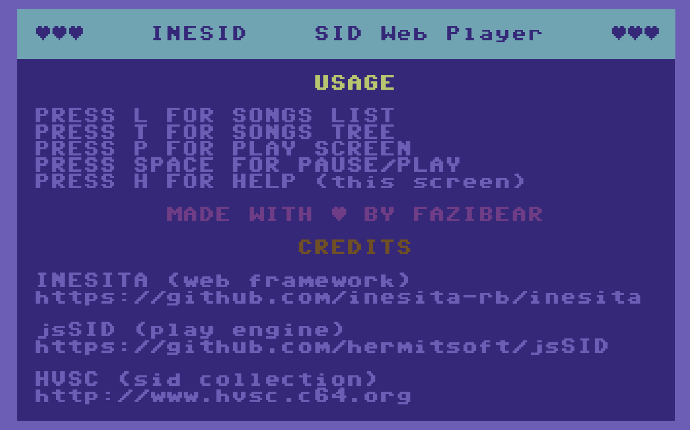
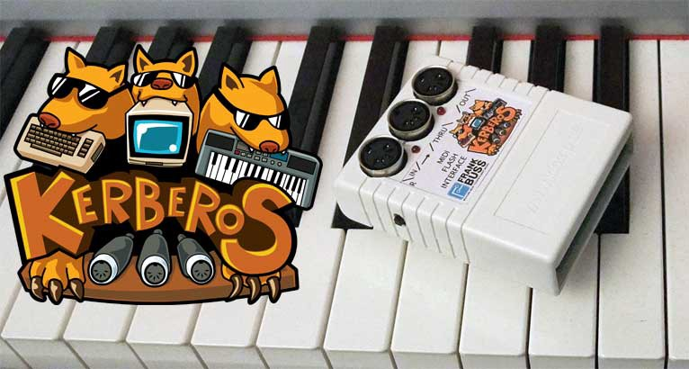
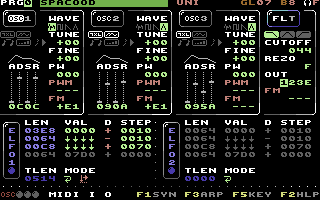

A long time ago, I’ve written [Inesid](https://inesid.fazibear.me/), a SID files Web Player. It looks like an old Commodore 64 program with a retro interface. Lately, I’ve added a tree view, so you can easily browse all [HVSC](http://www.hvsc.c64.org/) collection and play a file you want.

But there was something that bothers me! Can I play all these songs directly on my Commodore 64 ?

After a research, the answer is yes!

All I need is a MIDI cartridge for Commodore 64. Luckily I have [kerberos](http://www.frank-buss.de/kerberos/index.html).

Great! Another thing is a software. There are a lot of software that can play midi notes, but there is not enough. There must be something else. Then I found [Station64](http://csdb.dk/release/?id=142049). Is support a ASID protocol. But there is no any working SID player that supports this protocol.

Chrome now supports [WebMIDI](https://www.w3.org/TR/webmidi/). So why not Inesid ?
Because I can’t find any ASID documentation online, I’ve asked the Station64 author. Got it! It was really fast. Thanks a lot!

Now I’d like to present to you, shiny new Inesid that can play SID files on the real commodore. All you need is to run Station64, choose MIDI port and play! Check it out!

https://www.youtube.com/watch?v=Wz__0n9W2fw
