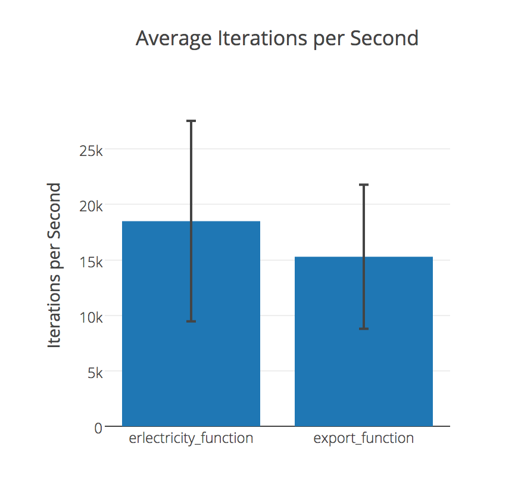
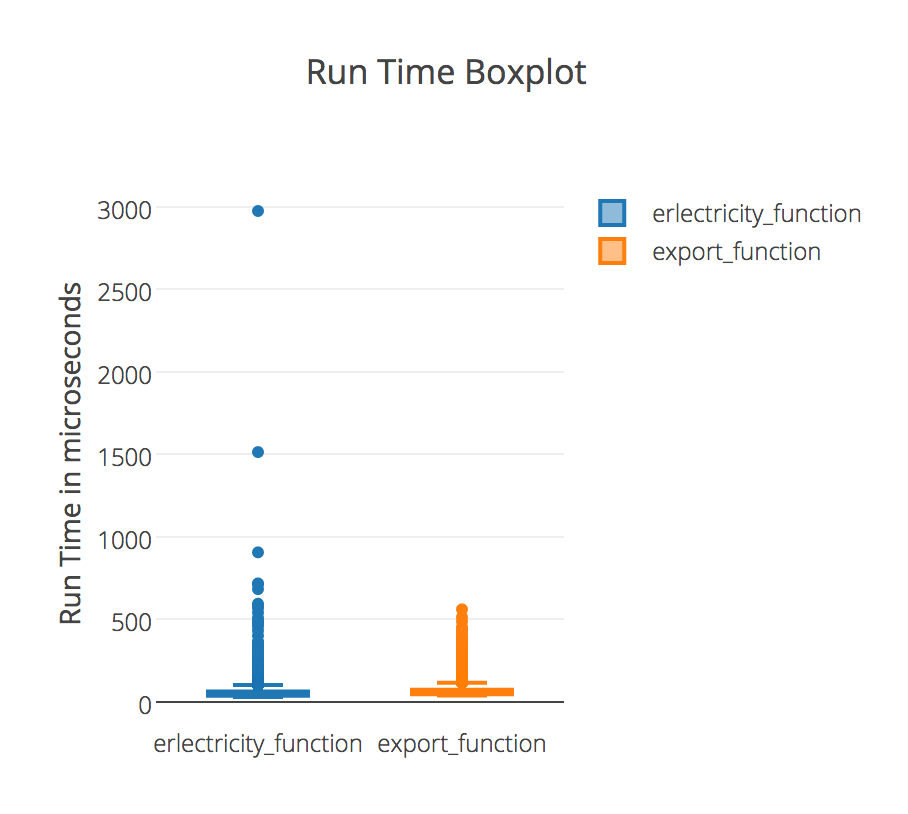
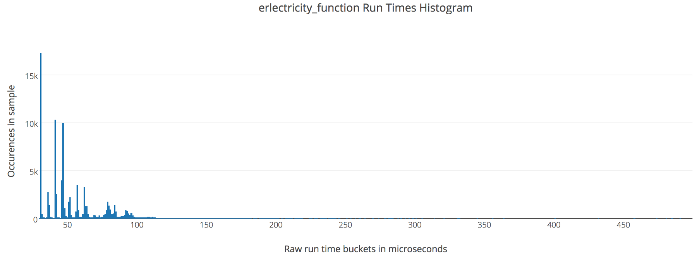
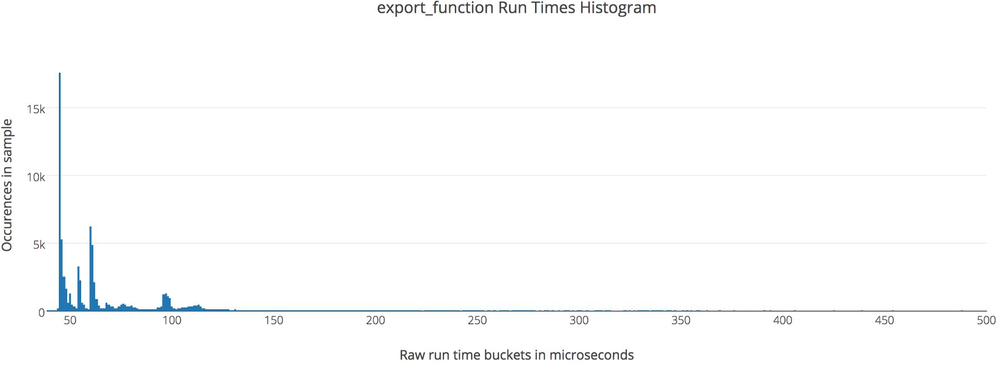
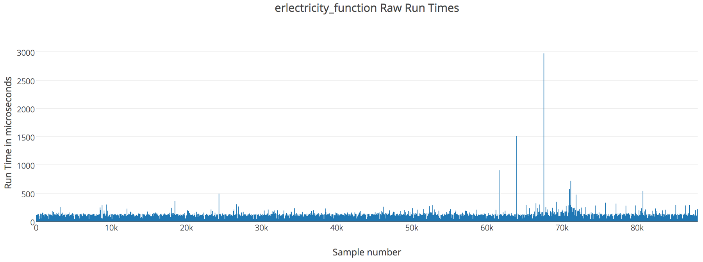
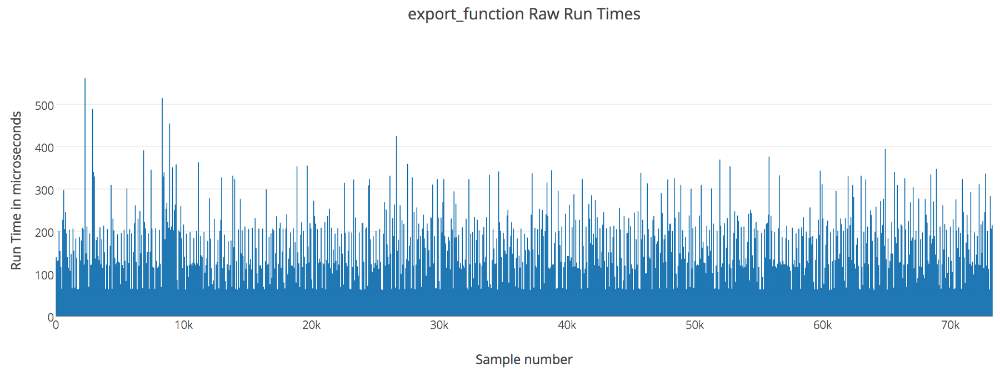

Now we know how to talk to Ruby from Elixir. We’ve been described 3 methods so far. Now it’s time for comparisons and benchmarks. If you want to benchmark it yourself you can use the application in this [repository](https://github.com/fazibear/exrbbench). Let’s start!

### Note about Erlang VM and safety

None of these 3 methods will crash Erlang VM. Is completely save. Of course is your job to supervise ruby processes, and take care of them, but even if they crash they will not crash your Elixir application.

### Erlix is unstable

First of all, this benchmark excludes Erlix, it’s commented out, because it very unstable, and it crashes after 1500 messages. I’ve looked at the source and there are a lot of TODOs when it comes to memory management. You can uncomment it if you want to try.

### What to benchmark

We will compare these 3 things:

- Calling a function from other Erlang process
- Calling a function from ruby process with Export
- Calling a function from ruby process with Erlectricity

### Benchmark time

Finally show me the numbers!

```text
Erlang/OTP 19 [erts-8.0] [source] [64-bit] [smp:4:4] [async-threads:10] [hipe] [kernel-poll:false]
Elixir 1.3.4
Benchmark suite executing with the following configuration:
warmup: 2.0s
time: 5.0s
parallel: 1
inputs: none specified
Estimated total run time: 21.0s
Benchmarking erlectricity_function...
Benchmarking export_function...
Benchmarking process_function...
Name                            ips    average  deviation         median
process_function           692.99 K    1.44 μs   ±117.57%   1.40 μs
erlectricity_function       18.61 K    53.72 μs   ±46.84%  47.00 μs
export_function             15.72 K    63.61 μs   ±43.26%  55.00 μs
Comparison:
process_function           692.99 K
erlectricity_function       18.61 K - 37.23x slower
export_function             15.72 K - 44.08x slower
```

I really want to show nice charts, but they are unreadable. Just because calling functions from ruby is about 40 times slower. Let’s try to compare just these two.

```text
Erlang/OTP 19 [erts-8.0] [source] [64-bit] [smp:4:4] [async-threads:10] [hipe] [kernel-poll:false]
Elixir 1.3.4
Benchmark suite executing with the following configuration:
warmup: 2.0s
time: 5.0s
parallel: 1
inputs: none specified
Estimated total run time: 14.0s
Benchmarking erlectricity_function...
Benchmarking export_function...
Generated bench/index.html
Name                            ips    average  deviation         median
erlectricity_function       18.49 K   54.07 μs    ±48.86%   47.00 μs
export_function             15.28 K   65.43 μs    ±42.51%   57.00 μs
Comparison:
erlectricity_function       18.49 K
export_function             15.28 K - 1.21x slower
```



Now we see that `export` is 1.21 times slower that `erlectricity`. Why ?
Erlectricity is written as a C extension for ruby, so there is no surprise.






More detailed charts are pretty similar .To sum it up, you have to decide what will fit your needs.
