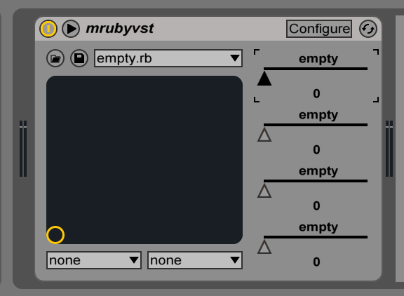

When I first read about [MRuby](https://mruby.org/), I just want to play with it. The first thing that came to my mind was a [VST](https://en.wikipedia.org/wiki/Virtual_Studio_Technology) plugin. I could build a little wrapper, and pass all function to ruby interpreter. I’ll describe how I’ve done this.

## Preparing

First of all, we need to setup few things. Let’s start with MRuby.

## MRuby

We need to clone MRuby repo:

```bash
$ git clone https://github.com/mruby/mruby
$ cd mruby
```

After that, we need to configure our MRuby build. We need to modify `build_config.rb`. At the end of the file, let’s add our build specification.

```ruby
MRuby::Build.new('mrubyvst') do |conf|
  toolchain :gcc
  conf.gembox 'default'
  conf.gem :core => 'mruby-eval'
  conf.gem :github => 'iij/mruby-dir'
  conf.gem :github => 'iij/mruby-io'
end
```

In this case, we specify that we will use a `gcc` toolchain. Also, we will include all default gems and few other. In MRuby gems are compiled in. So if you want to change a gem set, you have to recompile mruby build. We will need `mruby-eval` to allow ruby script load other ruby scripts, `mruby-dir` to list directory content and `mruby-io` to access to files etc.

We’re done, we should compile it.

```bash
$ rake
```

At the end of build process we, will see

```txt
================================================
      Config Name: mrubyvst
 Output Directory: build/mrubyvst
    Included Gems:
             mruby-sprintf - standard Kernel#sprintf method
             mruby-print - standard print/puts/p
             mruby-math - standard Math module
             mruby-time - standard Time class
             mruby-struct - standard Struct class
             mruby-enum-ext - Enumerable module extension
             mruby-string-ext - String class extension
             mruby-numeric-ext - Numeric class extension
             mruby-array-ext - Array class extension
             mruby-hash-ext - Hash class extension
             mruby-range-ext - Range class extension
             mruby-proc-ext - Proc class extension
             mruby-symbol-ext - Symbol class extension
             mruby-random - Random class
             mruby-object-ext - Object class extension
             mruby-objectspace - ObjectSpace class
             mruby-fiber - Fiber class
             mruby-enumerator - Enumerator class
             mruby-enum-lazy - Enumerator::Lazy class
             mruby-toplevel-ext - toplevel object (main) ...
             mruby-compiler - mruby compiler library
             mruby-bin-mirb - mirb command
               - Binaries: mirb
             mruby-bin-mruby - mruby command
               - Binaries: mruby
             mruby-bin-strip - irep dump debug section ...
               - Binaries: mruby-strip
             mruby-kernel-ext - Kernel module extension
             mruby-class-ext - class/module extension
             mruby-eval - standard Kernel#eval method
             mruby-dir
             mruby-io
```

Great we just built MRuby. Let’s move on.

## VST SDK

We want to build the VST plugin. We have to download SDK from [Steinberg Website](https://www.steinberg.net/en/company/developers.html) and unpack it somewhere on your computer.

## DAW

We will also need a [DAW](https://en.wikipedia.org/wiki/Digital_audio_workstation) that will load our plugin. I’ve tested it with [Ableton Live 9](https://www.ableton.com/en/live/whats-new/). There is a trial version, but also a demo. In demo mode, you can’t save you project, but we don’t need this feature. There are 32-bit and 64-bit builds, we will build 64-bit version, so we will need 64-bit daw.

## Building VST

Next thing is a VST plugin itself. We will clone the repository, set it up and launch it within the DAW.

```bash
$ git clone https://github.com/fazibear/mrubyvst
$ cd mrubyvst
$ rake init
```

Take a look at `Rakefile`, on the top there are constants.

```ruby
MRUBY_DIR = File.expand_path('../mruby')
VST_SDK_DIR = File.expand_path('../vst-sdk')
SCRIPT_PATH = File.expand_path('./mrubyvst.rb')
VST_CLASS = 'MRubyVST'
PROGRAMS_COUNT = 10
PARAMETERS_COUNT = 4
```

We have to change `MRUBY_DIR` and `VST_SDK_DIR` to correct place of these libraries on your computer. `SCRIPT_PATH` points to a file that will load into Ruby VM on initialising, and `VST_CLASS` is the class name that MRuby will instantiate. Now we can build it!

```bash
$ rake
```

We’ve just build it. Does it work? No. We need to copy or link it to a special directory, so DAW can find it. On Mac VST plugins are in ~/Library/Audio/Plug-Ins/VST/. But wait. There is a script that will do it for you.

```bash
$ rake link
```

Will link your VST build to that directory. You can also unlink it with.

```bash
$ rake unlink
```

## Starting a DAW

We are ready to launch DAW. If you don’t know how to use VST plugin here is a little tutorial. Good luck.

This is how VST look like in Ableton Live (in other DAW will look different)



Great! The plugin works, now we will look at implementation details.

Implementation
Take a look at `mrubyvst.h` file.

```cpp
#include "public.sdk/source/vst2.x/audioeffectx.h"

#include <mutex>

#include "mruby.h"
#include "mruby/compile.h"
#include "mruby/string.h"
#include "mruby/array.h"
#include "mruby/class.h"
#include "mruby/variable.h"

//-------------------------------------------------------------------------------------------------------
class MRubyVst : public AudioEffectX {

public:
  MRubyVst(audioMasterCallback audioMaster);
  ~MRubyVst();

  // Processing
  virtual void processReplacing(float** inputs, float** outputs, VstInt32 sampleFrames);

  // Program
  virtual void setProgram(VstInt32 index);
  virtual bool getProgramNameIndexed(VstInt32 category, VstInt32 index, char* text);

  // Parameters
  virtual void setParameter(VstInt32 index, float value);
  virtual float getParameter(VstInt32 index);
  virtual void getParameterLabel(VstInt32 index, char* label);
  virtual void getParameterDisplay(VstInt32 index, char* text);
  virtual void getParameterName(VstInt32 index, char* text);

  // Info
  virtual bool getEffectName(char* name);
  virtual bool getVendorString(char* text);
  virtual bool getProductString(char* text);
  virtual VstInt32 getVendorVersion();

  // Helpers
  void log(const char* txt);

protected:
  std::mutex m;
  mrb_state *mrb;
  mrb_value vst_instance;
};
```

In VST there are 4 groups of things that we need to implement.

Most important is processing. In this method, we will change an input audio data. But we will cover this method later. The second group is programs. The program is a state of all parameters. And parameters are single variables that sound processing depends on. The last one is info. VST have to return some pieces of information to identify yourself.

Let’s visualize them. On top we see mrubyvst, it’s a name of our plugin. Dropdown with empty.rb is a programs field. There is a list of programs. And on the right, there are 4 parameters with names and values. We need to decide how many programs and parameters we will need before compilation. In our example, there are 10 programs and 4 parameters.

But wait. What about Ruby ? This is C++ header file! That’s correct, we need to create a little wrapper that passes information to and from Ruby VM. Stay calm.

## Initialization

The constructor is a great place to initialise our Ruby land. After that, we need to load Ruby script and instantiate our MRubyVST class. Also, we need to set few constants in that class.

```cpp
MRubyVst::MRubyVst(audioMasterCallback audioMaster): AudioEffectX(audioMaster, PROGRAMS_COUNT, PARAMETERS_COUNT) {
  setUniqueID(666);
  canProcessReplacing();

  setNumInputs(2);
  setNumOutputs(2);

  mrb = mrb_open();

  FILE *file = fopen(SCRIPT_PATH, "r");
  if (file != NULL) {
    mrb_load_file(mrb, file);

    mrb_value vst_class = mrb_vm_const_get(mrb, mrb_intern_lit(mrb, VST_CLASS));
    mrb_const_set(mrb, vst_class, mrb_intern_lit(mrb, "PROGRAMS_COUNT"), mrb_fixnum_value(PROGRAMS_COUNT));
    mrb_const_set(mrb, vst_class, mrb_intern_lit(mrb, "PARAMETERS_COUNT"), mrb_fixnum_value(PARAMETERS_COUNT));
    mrb_const_set(mrb, vst_class, mrb_intern_lit(mrb, "SAMPLE_RATE"), mrb_float_value(mrb, getSampleRate()));
    mrb_const_set(mrb, vst_class, mrb_intern_lit(mrb, "SCRIPT_PATH"), mrb_str_new_cstr(mrb, (SCRIPT_PATH)));

    vst_instance = mrb_instance_new(mrb, vst_class);

    fclose(file);
  }
}
```

The most important part is line 8. This is where we start our embedded Ruby VM. Next, we are opening a file and if it exists loads into our VM.
Now our Ruby script is loaded. Line 14 will get our Ruby class, and allow us to set few constants. After that, we can instantiate it, and close file.

## The Ruby Script

```ruby
class MRubyVST
  attr_reader :vendor, :product, :effect_name, :version

  def initialize
    @vendor = 'Mruby'
    @product = 'MrubyVST'
    @effect_name = 'MRubyEffects'
    @version = 0
    @programs_dir = "#{File.dirname(SCRIPT_PATH)}/programs"
  end

  def programs
    Dir.entries(@programs_dir) - ['.', '..']
  end

  def load_program(path)
    Module.new.instance_eval(
      File.open(path).read
    )
  end

  def change_program(index)
    @program = load_program("#{@programs_dir}/#{programs[index]}") if programs[index]
  end

  def program_name(index)
    programs[index] || "-empty-"
  end

  def set_parameter(index, value)
    @program.set_parameter(index, value) if @program
  end

  def parameter_name(index)
    @program.parameter_name(index) if @program
  end

  def parameter_value(index)
    @program.parameter_value(index) if @program
  end

  def parameter_display_value(index)
    @program.parameter_display_value(index) if @program
  end

  def parameter_label(index)
    @program.parameter_label(index) if @program
  end

  def process(data)
    @program.process(data) if @program
  end

  def log(str)
    io = File.open('/tmp/mrubyvst.log', 'a')
    io.write(str + "\n")
    io.close
  end
end
```

This is the Ruby script. All information are here. Vendor, product, version etc. Our plugin will use programs to load various Ruby modules. When user will change a program, we will instantiate the new class and pass most methods to this module. Programs list is just a files from programs `directory`. Simple submodule looks like this:

```ruby
class GainVST
  def initialize
    @gain = 1.0
  end

  def set_parameter(index, value)
    @gain = value if index = 0
  end

  def parameter_name(index)
    index == 0 ? 'Gain' : 'empty'
  end

  def parameter_value(index)
    @gain if index == 0
  end

  def parameter_display_value(index)
    @gain.to_s if index == 0
  end

  def parameter_label(index)
    'dB' if index == 0
  end

  def process(data)
    data[0].map!{ |left | left * @gain}
    data[1].map!{ |right| right * @gain }
    data
  end
end

GainVST.new
```

It’s a simple gain plugin. That will change the volume of input audio, depending on how gain is set. The default is 1. What are these methods do ? We will use only one parameter with index 0 (zero)

- parameter_name: return a name of parameter with given index
- parameter_value: return a value of parameter with given index
- parameter_display_value: return a value of parameter with given index as a string, you can format it as you like
- parameter_label: return label of our parameter
- set_parameter: set a value of parameter with given index
- process: process input data and return output. In this case, will multiply all input values with a gain value.

## MRuby Wrapper

Now we need to move back to our wrapper. And implement methods that will pass data to ruby and back. Most methods look very similar, look at one here:

```cpp
bool MRubyVst::getProgramNameIndexed(VstInt32 category, VstInt32 index, char* text) {
  m.lock();
  if(!mrb_nil_p(vst_instance) && mrb_respond_to(mrb, vst_instance, mrb_intern_lit(mrb, "program_name"))){
    mrb_value mrb_name = mrb_funcall(mrb, vst_instance, "program_name", 1, mrb_fixnum_value(index));
    if (!mrb_nil_p(mrb_name)) {
      vst_strncpy(text, RSTRING_PTR(mrb_name), kVstMaxProgNameLen);
      m.unlock();
      return true;
    }
  }

  m.unlock();
  return false;
}
```

Because MRuby is not thread-safe we need to use Mutex. Lock it when we start using MRuby and unlock at the end. Check if our VST instance is not nil, and if it responds to program_name method. Now we can invoke it if result is not nil we can decode it and copy it so VST can read it. Returning true means that we copied something. It is not very complicated to figure out when and how data are converted. Now take a look at the most important thing. Audio processing.

```cpp
void MRubyVst::processReplacing(float** inputs, float** outputs, VstInt32 sampleFrames) {
  m.lock();
  if(!mrb_nil_p(vst_instance) && mrb_respond_to(mrb, vst_instance, mrb_intern_lit(mrb, "process"))){
    int ai = mrb_gc_arena_save(mrb);

    float* in1  =  inputs[0];
    float* in2  =  inputs[1];
    float* out1 = outputs[0];
    float* out2 = outputs[1];

    mrb_value mrb_inputs = mrb_ary_new(mrb);
    mrb_value mrb_input_1 = mrb_ary_new(mrb);
    mrb_value mrb_input_2 = mrb_ary_new(mrb);

    for (int i=0;i<sampleFrames;i++) {
      mrb_ary_push(mrb, mrb_input_1, mrb_float_value(mrb, (*in1++)));
      mrb_ary_push(mrb, mrb_input_2, mrb_float_value(mrb, (*in2++)));
    }

    mrb_ary_push(mrb, mrb_inputs, mrb_input_1);
    mrb_ary_push(mrb, mrb_inputs, mrb_input_2);

    mrb_value mrb_outputs = mrb_funcall(mrb, vst_instance, "process", 1, mrb_inputs);

    //mrb_value mrb_outputs = mrb_inputs;

    if (!mrb_nil_p(mrb_outputs)) {
      mrb_value mrb_output_1 = mrb_ary_shift(mrb, mrb_outputs);
      mrb_value mrb_output_2 = mrb_ary_shift(mrb, mrb_outputs);

      for (int i=0;i<sampleFrames;i++) {
        (*out1++) = mrb_float(mrb_ary_shift(mrb, mrb_output_1));
        (*out2++) = mrb_float(mrb_ary_shift(mrb, mrb_output_2));
      }
    }
    mrb_gc_arena_restore(mrb, ai);
  }
  m.unlock();
}
```

Few things happening here. We need to instruct Ruby Garbage Collector to remove unused data. This is what line 4 and 36 do. All objects created between these lines can be garbage collected, so we will not have any memory leaks. Next, we need to convert an array of floats into Ruby array of floats. Creating a Ruby arrays for each input and add a converted float to it. Now we can invoke a process method with parameters. The result of that method is converted back to C array of floats and then passed to DAW.

## Final Words

Yes, it works. Of course, the simple gain plugin takes a lot more CPU than written in C. But as you know, we need to pack it into Ruby object and extract at the end. Now you can do whatever you want with the audio stream in Ruby. There are few example plugins like pan and stereo enhancer. But also you can create your own. Try to run web server within. Anything. In Ruby, it’s simpler and more fun.

## MRubyByExample

It was hard to debug MRuby behavior in VST. So I’ve made a little script to test it out. If you want to play with MRuby you can check out [this](https://github.com/fazibear/mrubybyexample) repo, and look at this documentation. Maybe you’ll find something interesting there.
