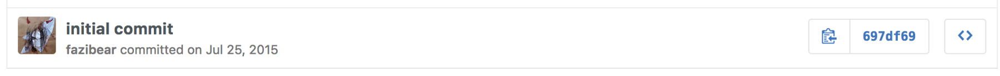

[Inesita](https://github.com/inesita-rb/inesita) aims to be a simple, light, Ruby front-end framework. It’s a component based framework focused on building web applications. Inesita uses an [Opal](https://github.com/opal/opal) runtime, so you will write Ruby code instead of JavaScript. Inesita is responsible only for view layer, development process and release build mechanism. Other things like how you store and change application state depends on you. View layer is built on top of [virtual-dom](https://github.com/Matt-Esch/virtual-dom), so there is no pain to render entire tree of components lot of times. But let’s start from the beginning.

## The Beginning

Why I started this kind of project ?
Well, the process of creating Inesita was something that we can call Wishful Driven Development. And what is that ? The first thing that I wrote is how I want to my component class look like. And it was something like this:

```ruby
class Example
  include Inesita::Component

  def render
    div.jubmotron class: 'text-center' do
      img src: 'static/inesita-rb.png'
      h1 do
        text "Hello I'm Inesita"
      end
    end
  end
end
```

Yes, it’s Ruby. But there was a great gem called Opal. [Opal](https://github.com/opal/opal) is a ruby to javascript compiler. So my dream can come true. Right ? Right.

After few hours of setting up Opal environment, and figuring out how it works, I simply start implementing a Component module using virtual-dom. Step by step I’ve ended up with working component. On top of the existing component, I’ve created a router. And that how things were going.

Inesita was born on July 25th, 2015. Here is a birth certificate.



## Goals!

Inesita has a few goals that I want to stick with.

## It’s all about front-end

First of all, I want to keep Inesita a pure front-end framework. There is no integration with rails or any other backend framework. Just a browser side with tools to generate new application template generate static files, etc.

## Keep It Beautiful

Inesita is cute, isn’t it ? Ruby’s syntax is beautiful. So all things written in ruby should also be beautiful. There is a nice DSL for HTML Markup.
HTML related callback also will look beautiful. Inesita was built to be beautiful, and should stay like that.

```ruby
class Example
  include Inesita::Component

  def click(event)
    event.prevent_default!
  end
  def render
    div.jubmotron class: 'text-center' do
      img src: 'static/inesita-rb.png', onclick: method(:click)
      h1 do
        text "Hello I'm Inesita"
      end
    end
  end
end
```

## Modularity

I want to keep Inesita as small as possible. There is [opal-virtual-dom](https://github.com/fazibear/opal-virtual-dom) gem that is responsible for HTML markup. You can use [inesita-router](https://github.com/inesita-rb/inesita-router) if you like. There is an injection mechanism, so you can implement application state the way you like. And of course [inesita-livereload](https://github.com/inesita-rb/inesita-livereload), so you will never have to refresh the browser when you change the code. And a command line tool, that can generate an empty application with all necessary gems, directory structure etc.

## Examples

There is a bunch of examples and working applications. All of them are listed in [awesome-inesita](https://github.com/inesita-rb/awesome-inesita). You can check [asciifyme](https://asciifyme.fazibear.me/) or [inesid](https://inesid.fazibear.me/). There is a todomvc example app. Just check them. Of course, there is a documentation [here](https://inesita.fazibear.me/). It’s like a tutorial, how you can make you first Inesita application step by step.

## Can I use Inesita ?

Sure, You should try Her and give me some feedback! I will be appreciated.
